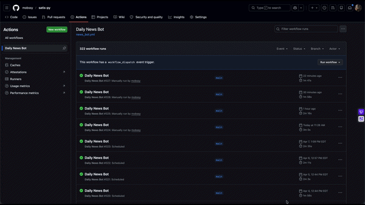

<div align="center">
 
# Satis-py
 
**AI-powered personal news briefing, delivered to Telegram every day at noon.**
 


 
<br />
 

 
</div>
 
---
 
## Why I Built This
 
I live between two worlds — Korea and the US.
 
Every morning, I found myself jumping between six different tabs: Korean news, New York local news, New Jersey updates, Big Tech headlines, Apple-related news, and global top stories. It was fragmented, slow, and honestly exhausting.
 
So I built Satis-py. One bot. Six categories. Five stories each. Summarized by AI. In my Telegram. Every day at noon.
 
The name is simple: **Satisfy** + **Python** = **Satis-py**.
Because staying informed should feel good — not like a chore.
 
---
 
## What It Does
 
Every day at **12:00 PM**, Satis-py automatically:
 
1. Fetches the hottest headlines across 6 categories
2. Summarizes each story into one clean line using OpenAI
3. Delivers everything to Telegram — formatted and ready to read
 
```
📰 오늘의 뉴스 브리핑
 
1️⃣ Headline
→ One-line AI summary
 
2️⃣ Headline
→ One-line AI summary
 
3️⃣ Headline
→ One-line AI summary
 
4️⃣ Headline
→ One-line AI summary
 
5️⃣ Headline
→ One-line AI summary
```
 
**Categories covered:**
 
| World | Korea | New York | New Jersey | Big Tech | Apple |
|:---:|:---:|:---:|:---:|:---:|:---:|
| Top 5 | Top 5 | Top 5 | Top 5 | Top 5 | Top 5 |
 
---
 
## Tech Stack
 
| Layer | Tool |
|---|---|
| Language | Python 3.11+ |
| AI Summarization | OpenAI API (GPT-4o-mini) |
| Messaging | Telegram Bot API |
| Scheduling | APScheduler |
 
---
 
## Getting Started
 
### 1. Clone
 
```bash
git clone https://github.com/yourusername/satis-py.git
cd satis-py
```
 
### 2. Install dependencies
 
```bash
pip install -r requirements.txt
```
 
### 3. Configure environment
 
```bash
cp .env.example .env
```
 
```env
OPENAI_API_KEY=your_openai_api_key
TELEGRAM_BOT_TOKEN=your_telegram_bot_token
TELEGRAM_CHAT_ID=your_chat_id
```
 
### 4. Run
 
```bash
python main.py
```
 
Set it. Forget it. Get your briefing at noon.
 
---
 
## Project Structure
 
```
satis-py/
├── main.py            ← Entry point & scheduler
├── fetcher.py         ← News fetching
├── summarizer.py      ← OpenAI summarization
├── bot.py             ← Telegram delivery
├── .env.example
├── requirements.txt
└── assets/
    └── demo.gif
```
 
---
 
## License
 
MIT
 
---
 
---
 
<div align="center">
 
# Satis-py
 
**AI가 요약한 오늘의 뉴스를, 매일 정오 텔레그램으로.**
 


 
<br />
 

 
</div>
 
---
 
## 왜 만들었냐면
 
저는 한국과 미국, 두 세계를 오가며 살고 있습니다.
 
매일 아침마다 탭을 여섯 개씩 열었어요. 한국 뉴스, 뉴욕 로컬 뉴스, 뉴저지 소식, 빅테크 헤드라인, Apple 관련 뉴스, 그리고 세계 빅뉴스. 파편화되고, 느리고, 솔직히 피곤했습니다.
 
그래서 Satis-py를 만들었습니다. 봇 하나. 카테고리 여섯 개. 카테고리별 뉴스 다섯 개. AI 요약. 텔레그램으로. 매일 정오에.
 
이름은 간단합니다: **Satisfy**(만족) + **Python** = **Satis-py**.
정보를 얻는 게 즐거워야 하니까요 — 부담이 아니라.
 
---
 
## 어떻게 작동하냐면
 
매일 **오후 12시**, Satis-py가 자동으로:
 
1. 6개 카테고리에서 가장 핫한 헤드라인 수집
2. OpenAI로 각 뉴스를 한 줄로 요약
3. 텔레그램으로 깔끔하게 포맷해서 전송
 
```
📰 오늘의 뉴스 브리핑
 
1️⃣ 뉴스 제목
→ AI 한 줄 요약
 
2️⃣ 뉴스 제목
→ AI 한 줄 요약
 
3️⃣ 뉴스 제목
→ AI 한 줄 요약
 
4️⃣ 뉴스 제목
→ AI 한 줄 요약
 
5️⃣ 뉴스 제목
→ AI 한 줄 요약
```
 
**커버하는 카테고리:**
 
| 세계 | 한국 | 뉴욕 | 뉴저지 | 빅테크 | 애플 |
|:---:|:---:|:---:|:---:|:---:|:---:|
| 상위 5개 | 상위 5개 | 상위 5개 | 상위 5개 | 상위 5개 | 상위 5개 |
 
---
 
## 기술 스택
 
| 레이어 | 기술 |
|---|---|
| 언어 | Python 3.11+ |
| AI 요약 | OpenAI API (GPT-4o-mini) |
| 메시징 | Telegram Bot API |
| 스케줄링 | APScheduler |
 
---
 
## 시작하기
 
### 1. 클론
 
```bash
git clone https://github.com/yourusername/satis-py.git
cd satis-py
```
 
### 2. 의존성 설치
 
```bash
pip install -r requirements.txt
```
 
### 3. 환경변수 설정
 
```bash
cp .env.example .env
```
 
```env
OPENAI_API_KEY=your_openai_api_key
TELEGRAM_BOT_TOKEN=your_telegram_bot_token
TELEGRAM_CHAT_ID=your_chat_id
```
 
### 4. 실행
 
```bash
python main.py
```
 
설정 끝. 잊어버려도 됩니다. 정오에 브리핑이 도착합니다.
 
---
 
## 프로젝트 구조
 
```
satis-py/
├── main.py            ← 진입점 & 스케줄러
├── fetcher.py         ← 뉴스 수집
├── summarizer.py      ← OpenAI 요약
├── bot.py             ← 텔레그램 전송
├── .env.example
├── requirements.txt
└── assets/
    └── demo.gif
```
 
---
 
## 라이선스
 
MIT
